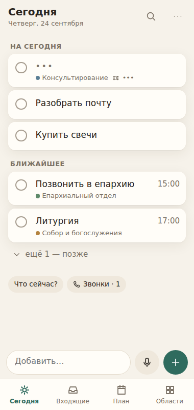
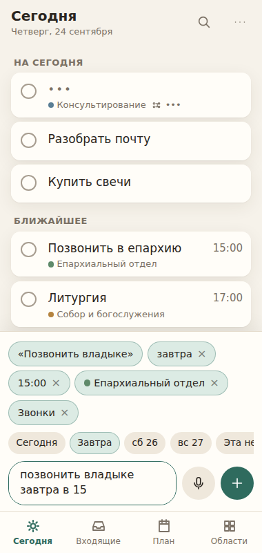
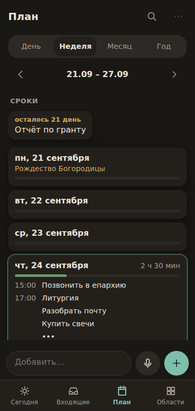

# Планировщик

Личный планировщик для Android. Ставится на рабочий стол как приложение, полностью работает
без интернета, без сервера и без аккаунтов. Все данные — только на телефоне.

<p>



</p>

Главное:

- **Данные не теряются.** Хранилище IndexedDB с защитой от очистки, автоматические внутренние
  копии (каждый день и перед каждым обновлением), резервная копия одним файлом.
- **Добавить задачу — за 5 секунд**, в том числе голосом: «позвонить владыке завтра в 15»,
  «сессия с А.К. в чт в 18», «отчёт по гранту до 15.10».
- **Открывать без тяжести.** На «Сегодня» — три главных дела, ближайшее по времени и одна строка
  «ещё N — позже». Никаких красных счётчиков, «просрочено» и процентов.
- **Цепочки работы** (например, цикл сессии с клиентом) запускаются одной фразой. Цепочки
  собираются в самом приложении, без программирования.
- **Обмен задачами с женой** — обычной ссылкой через мессенджер.

---

## 1. Включить GitHub Pages

1. На GitHub откройте репозиторий → **Settings** → **Pages**.
2. В разделе **Build and deployment**: Source — **Deploy from a branch**,
   Branch — **main**, папка — **/docs**. Нажмите **Save**.
3. Через минуту-другую появится адрес вида `https://<ваш-логин>.github.io/planner/`.
   Его и нужно открыть на телефоне.

GitHub Pages нужен только для того, чтобы один раз скачать приложение и получать обновления.
Данные туда не отправляются: своего сервера у приложения нет и не будет.

## 2. Установить себе

1. Откройте адрес из п. 1 в **Chrome** или **Яндекс.Браузере** на Android (не во встроенном
   браузере мессенджера — там установки нет).
2. Меню **⋮** → **Установить приложение** (в Яндекс.Браузере — «Установить приложение» или
   «Добавить ярлык на домашний экран»). Chrome показывает этот пункт, когда с сайтом немного
   поработали: коснитесь чего-нибудь и подождите около полуминуты.
   Если пункта нет — в приложении **Меню → Настройки → «Установка на рабочий стол»**: там
   проверка всех условий установки (что выполнено, что нет) и, если браузер готов, кнопка
   **«Установить приложение»**.
3. Запустите с рабочего стола. Первый запуск занимает меньше двух минут: имя, контакты для
   обмена, беглый взгляд на области, постоянные блоки недели (можно пропустить).

После первого открытия приложение работает без интернета. Когда выходит новая версия, вверху
появляется ненавязчивое **«Обновить»** — данные при обновлении не трогаются.

## 3. Установить жене

1. Отправьте ей тот же адрес. Она ставит приложение так же (п. 2).
2. При первом запуске она пишет своё имя, а в контактах — вас (например, «Иоанн»).
   У контакта можно выбрать область для входящих задач.
3. У вас в контактах уже есть «Жена» (предлагается при первом запуске) — её задачи попадают
   в область «Семья».

**Как передать задачу:** ссылкой пересылаются только дела **без даты и времени** — поручения,
«купить», «узнать». Откройте задачу → **⋯** → **Отправить задачу** → выберите контакт →
отправьте в мессенджер. Уходит понятный текст («Иоанн: Купить хлеб») и ссылка.
Всё, что с датой и временем, другому человеку сообщается только через общий Яндекс.Календарь
(см. «Общий календарь в Яндексе»): у таких задач вместо «Отправить» — **«Добавить в календарь»**.
Все данные задачи — только в части ссылки после `#`, на сервер они не попадают.

- Получатель нажимает на ссылку — задача появляется во **«Входящих»** с пометкой «от …».
  Повторное открытие той же ссылки дубля не создаёт.
- Если ссылка открылась во встроенном браузере мессенджера, появятся кнопки
  **«Открыть в приложении»** и **«Скопировать код»**. Код потом вставляется в приложении:
  **Входящие → Вставить задачу**.
- Отправленная задача у вас переходит в раздел **«Жду от …»** (во «Входящих»).
- Когда получатель закрывает задачу, приложение предложит **«Сообщить, что сделано»** —
  по этой ссылке задача закроется и у вас.
- Любой текст из другого приложения можно отправить в планировщик через **«Поделиться»** —
  он разберётся так же, как ввод с клавиатуры.
- **Область для входящих от контакта может быть закрытой** (Настройки → Контакты для обмена →
  Область). Тогда задачи от этого человека скрыты («•••») сразу при получении — и во
  «Входящих» тоже.
- Если задача пришла не туда, у неё во «Входящих» есть кнопка **«Скрыть»**: одно касание
  переносит её в закрытую область.

## 3а. Запись сессий ассистентом

Жена (или другой ассистент) может записывать вам сессии со своего телефона.

1. У себя: **Настройки → Контакты для обмена → «Жена» → «Записывает мне сессии»**. Приложение
   предложит сразу отправить ей настройку — ссылку. Она открывает её в своём планировщике и
   нажимает **«Включить»**. (Можно и вручную: у неё в контакте «Иоанн» — «Я записываю ему сессии».)
2. У неё на «Сегодня» появляется крупный пункт **«Записать сессию»**: клиент, дата и время
   начала, по желанию — окончание (в том числе на другой день). **Поле «Клиент» — обычный текст**:
   она пишет человека так, как привыкла его называть (имя, фамилия, как договорились). Никаких
   кодов и инициалов с её стороны не нужно.
3. **«Сохранить»** → сразу экран с одной крупной кнопкой **«Добавить в Яндекс.Календарь»**.
   Сессия попадает в общий календарь как «Сессия · А.К.» — с инициалами клиента, без имени.
   Других действий там нет: всё, что с датой и временем, вы видите через общий календарь.
   Если нужна цепочка подготовки, добавьте сессию у себя обычной фразой: «сессия с А.К. в пт в 18».
4. Ссылки на запись сессии из прежней версии приложения по-прежнему открываются у вас отдельным
   экраном: клиент (в закрытой области — скрыт, пока не коснёшься), начало, конец, область.
   Кнопка **«Добавить в план»** ставит сессию в план сразу, минуя «Входящие»:
   - если время накладывается на постоянный блок или другое дело, приложение спокойно скажет,
     с чем именно (название и время), и предложит **«Добавить всё равно»** или
     **«Изменить время»**;
   - кто это — приложение решает так:
     - имя точно совпадает с тем, что уже было раньше (или с кодом человека у вас) — сессия
       сразу привязывается к нему, растёт его счётчик, запускается его цепочка (подготовка,
       запись, разбор);
     - имя похоже на нескольких ваших людей (например, «Анна Кузнецова» и у вас есть «А.К.» и
       «Анна Л.») — короткий выбор: «Это А.К. или Анна Л., или новый человек?»;
     - совпадений нет — приложение предложит создать нового человека в закрытой области
       и спросит, **как отметить его у себя**: код или инициалы придумываете вы сами (предложены
       инициалы). Это ваша внутренняя пометка, жене её знать не нужно.
     Имя, которое пишет жена, у вас в открытом виде не хранится: приложение помнит только его
     «отпечаток», чтобы в следующий раз узнать человека сразу.
   - **«Не сейчас»** — запись ляжет во «Входящие» и не потеряется.

## 3б. Общий календарь в Яндексе

Один календарь на всё — и семейные дела, и работа, и сессии (из закрытых областей туда уходит
только слово «Встреча»). Приложение само в Яндекс не пишет и оттуда не читает: из браузера это
ненадёжно. Вместо этого оно отдаёт телефону файл события `.ics`, а вы открываете его
Яндекс.Календарём.

**Один раз завести календарь (делаете вы сами, на компьютере или в браузере телефона):**

1. Откройте [calendar.yandex.ru](https://calendar.yandex.ru) под своим аккаунтом.
2. Слева в списке календарей нажмите **«+»** (или «Новый календарь»), назовите его как угодно,
   например «Наш», и сохраните.
3. У этого календаря откройте настройки (значок ⋯ или шестерёнка рядом с названием) →
   раздел доступа (**«Поделиться»**) → добавьте аккаунт жены в Яндексе и выберите право
   **«Редактирование»**. Ей придёт приглашение — пусть примет его.
4. На **обоих телефонах** в приложении Яндекс.Календарь откройте **Настройки →
   «Календарь по умолчанию»** и выберите этот общий календарь. Тогда всё, что вы добавляете
   из планировщика, сразу попадает в него — без выбора календаря.

Названия пунктов в Яндексе иногда меняются; смысл всегда один: один календарь, доступ жене
на редактирование, он же — календарь по умолчанию у обоих.

**Как дела попадают в календарь.** Когда вы сохраняете задачу с датой и временем — любую,
семейную, рабочую или клиентскую, — или нажимаете **«Добавить в Яндекс.Календарь»**,
приложение пробует по порядку:

1. **Окно «Отправить в…»** с файлом события — выберите в нём Яндекс.Календарь. Так бывает, если
   браузер умеет передавать такие файлы.
2. Если не умеет — **открывает файл события во вкладке**, чтобы телефон сам предложил приложение.
   Браузеры на движке Chrome (сам Chrome и, скорее всего, Яндекс.Браузер) в этом случае файл
   не показывают, а начинают загрузку. Тогда подсказка под кнопкой скажет, что делать:
   откройте Загрузки → нажмите на файл → выберите Яндекс.Календарь.
3. Если на вашем телефоне это неудобно, в **Настройках → «Как передавать в календарь»** можно
   выбрать **«Скачивать файл»**: файл сразу ляжет в Загрузки, подсказка будет такой:
   «Файл скачан в Загрузки. Откройте Загрузки → нажмите на файл → выберите Яндекс.Календарь».
   Там же видно, чем закончилась последняя попытка.

Под кнопкой всегда есть напоминание: если календарь не предложили выбрать, после открытия
проверьте, что событие создано в **общем** календаре, а не в личном; при необходимости
переместите его в Яндекс.Календаре вручную (долгое нажатие на событие → «Переместить в календарь»).

Кнопка **«Добавить в Яндекс.Календарь»** всегда есть в карточке любой задачи с датой (со временем
или на весь день) и у задачи со сроком.

**Переключатель «Автоматически предлагать календарь»** (Меню → Настройки, включён сразу).
Включён — файл события сохраняется сам сразу после сохранения задачи со временем.
Выключен — ничего не происходит само; отправить задачу в календарь можно вручную: карточка
задачи → **«Добавить в календарь»**. Задачи без времени сами в календарь не уходят, но кнопка
в карточке у них есть (событие на весь день).

Если Яндекс.Календарь не появляется в списке приложений для файла `.ics`, откройте файл любым
календарём телефона или загрузите его в веб-версии Яндекс.Календаря (импорт событий из файла).

## 4. Голос и ярлыки

**Ярлыки.** Долгое нажатие на иконку приложения даёт три ярлыка:

- **Добавить задачу** — открывает только поле ввода; после сохранения — «Добавлено»,
  приложение можно сразу закрыть;
- **Голосом** — то же, но сразу слушает;
- **Сегодня**.

Любой ярлык можно перетащить на рабочий стол отдельной кнопкой.

**Голос.** Кнопка микрофона рядом с полем ввода использует распознавание речи браузера
(для него нужен интернет, если Chrome не умеет распознавать на самом телефоне). Запись
**включается и выключается только вами**: нажали микрофон — идёт запись, сколько бы вы ни
молчали между словами; остановить — крупная кнопка **«Стоп»** над полем или повторное нажатие
на микрофон. Если браузер сам обрывает распознавание на паузе, приложение тихо включает его снова —
для вас это один сеанс. Если распознавание недоступно, приложение подскажет диктовать
с клавиатуры — микрофон Gboard работает и без сети, если скачан русский язык. Разбор фразы
одинаковый в обоих случаях.

**Что понимает ввод.** Порядок слов и точная формулировка не важны: из фразы независимо
друг от друга вынимаются дата, начало и окончание, область, повтор, контекст, размер и важность,
а всё остальное становится текстом задачи. Не сказали область — остальное всё равно
распознается, область можно доуказать фишкой. Над полем появляются «фишки» — текст, область,
начало, окончание, повтор, контекст, размер; каждую можно исправить одним касанием.
Задача без даты и области уходит во «Входящие».

Например, «дежурство в семинарии с 16:00 до четверга 16:00, запиши в повторяющиеся» — это
**постоянный блок недели** «Дежурство в семинарии» (область «Семинария и школы»):
пн 16:00 → чт 16:00. Повтор по неделе вместе с началом и окончанием всегда становится
постоянным блоком; фишкой «постоянный блок» его можно одним касанием превратить
в повторяющуюся задачу.

| Что | Примеры |
| --- | --- |
| Начало и окончание | с 15 до 17, завтра с трёх до пяти, сегодня в 10, закончится в 12, начало в 9 утра, освобожусь к обеду, с 16:00 до четверга 16:00, с понедельника 9:00 до среды 18:00 |
| Регулярность | повторяющееся, регулярно, каждую неделю, это у меня всегда так, каждый вторник, по будням |
| Окончание без начала | сдать отчёт до 18:00 — срок сегодня до 18:00 |

| Что | Примеры |
| --- | --- |
| Дата | сегодня, завтра, послезавтра, в пятницу, в следующий вторник, через 3 дня, 15.10, 15 октября, на этой неделе, в ноябре |
| Время | в 15:00, в три часа дня, в пятнадцать тридцать, в полдесятого, утром / днём / вечером, через 2 часа |
| Жёсткий срок | до 15.10, до пятницы, к 1 октября, до конца месяца |
| Главное | «!» или «важно» |
| Повтор | каждый день в 7, каждый пн, по будням, каждые 3 дня, ежемесячно 5-го, ежегодно, через 30 дней после выполнения |
| Область | #семья, или ключевые слова области: «грант» → Ковчег жизни, «литургия» → Собор |
| Цепочка и человек | «сессия с А.К. в чт в 18», «лекция в семинарии 15 октября в 10» |
| Контекст | «позвонить», «перезвонить» → Звонки; «купить» → В городе |
| Размер | быстро / на час / большое |
| Уже сделано | «уже сделал …» — запишется сразу закрытым |

Ключевые слова областей и контекстов правятся в приложении.

## 5. Шаблоны (цепочки) и люди

**Шаблон** — это «рыба» повторяющейся работы: название, область, синонимы для голоса,
необязательный **якорь** (событие со временем, например сессия) и шаги. У каждого шага:
текст, когда (за N дней, за N минут, в момент якоря, сразу после, в тот же день, через N дней),
размер, контекст, текст-заготовка и правило: каждый раз / только первый раз / каждый N-й раз.

**Запуск:** фразой («сессия с А.К. в чт в 18»), из карточки человека или кнопкой
**«Цепочка…»** под полем ввода. Создаётся одна группа «Сессия · А.К. · №7», шаги встают
на свои даты. На «Сегодня» из цепочки виден только очередной шаг.

- Перенос якоря сдвигает все невыполненные шаги; отмена спрашивает, что сделать с шагами.
- Когда закрыт последний шаг — карточка **«Следующий раз?»**: через неделю в то же время,
  выбрать, пауза, завершить работу.
- Если у человека есть регулярное расписание (например, каждый чт 18:00), следующий цикл
  создаётся сам — не больше одного вперёд.
- Изменение шаблона не трогает уже созданные цепочки.

**Главный путь создания шаблона — из живого случая.** Сделайте задачу с чек-листом (или пройдите
цепочку), затем **⋯ → Сохранить как шаблон**. Приложение само предложит смещения шагов по их
фактическим датам — останется подтвердить. Создать шаблон с нуля тоже можно:
**Области → Шаблоны → Новый шаблон**.

Стартовые шаблоны «Сессия», «Лекция / выступление», «Пост в блог» — обычные примеры, их можно
менять и удалять. В шаге «Разбор транскрипта с Claude» пустая заготовка: вставьте туда свой промт
один раз в шаблоне — и он будет в каждой сессии с кнопкой «Скопировать».

**Люди** живут внутри области: код или инициалы, цвет, счётчик циклов (№ сессии), шаблон по
умолчанию, расписание, короткая заметка, статус (в работе / пауза / завершён).

**Тайна.** Область можно сделать **закрытой**: текст её задач и имена людей скрыты («•••»),
пока не коснёшься; по желанию — открытие по PIN (4 цифры, хранится только как хэш).
«Консультирование» закрыто с самого начала. Для клиентов используйте только код или инициалы.

Из закрытой области **ничего не уходит наружу**:

- задачу нельзя отправить, «Сообщить, что сделано» — только нейтральное «Сделано ✓»;
- в общий календарь (`.ics`) уходит только «Встреча» — и при автоматическом предложении, и вручную;
- текст-заготовку задачи нельзя скопировать (общий текст без данных клиента, например промт,
  копируется из самого шаблона: Области → Шаблоны → шаг → «Скопировать»);
- голос: в закрытой области работает только распознавание на самом телефоне (если Chrome его
  умеет); облачное распознавание браузера там отключено — можно диктовать с клавиатуры в
  офлайн-режиме. Что вы скажете на «Сегодня», приложение заранее знать не может — поэтому
  о клиентах лучше диктовать, открыв закрытую область.

Это правило только про то, что уходит **из** закрытой области. Всё, что приходит **вам**
(задачи, записи сессий), спокойно попадает внутрь.

Единственное исключение — ваша собственная резервная копия: в файле есть всё, включая закрытые
области, иначе она не была бы копией. Храните её там, где храните личное.

## 5а. Время и постоянные блоки

- **Время задачи — это начало.** Окончание необязательно: «в 14:00» — точка на ленте дня,
  которая не занимает времени; «с 15 до 17» или длительность в карточке — отрезок.
- **Постоянные блоки недели** (службы, приёмы, пары, дежурства): день и время начала и,
  по желанию, окончание — в тот же день или на следующий («пн 16:00 → вт 16:00»).
  Блок через полночь уменьшает ёмкость обоих дней и виден на ленте каждого дня своей частью.
  Блок без окончания длится столько, сколько задано у его области
  (Области → область → Настройки → «Постоянный блок без окончания длится», изначально 1 час),
  и не занимает остаток дня.

## 6. Резервная копия и восстановление

- **Автоматически:** приложение само делает внутреннюю копию раз в день и перед каждым
  обновлением данных. Их список — в **Меню → Резервная копия**, любую можно восстановить.
- **Файл:** **Меню → Резервная копия → Сохранить копию (JSON)** — один файл со всем:
  задачами, областями, людьми, шаблонами, настройками. Сохраните его в облако или отправьте
  себе в мессенджер. Это же — последний шаг недельного обзора. Если копии не было больше
  7 дней, на «Сегодня» появится мягкое напоминание.
- **Восстановить / перенести на новый телефон:** установите приложение, затем
  **Меню → Резервная копия → Загрузить из файла…**. Сначала покажется, что будет загружено;
  текущие данные перед заменой тоже сохраняются во внутреннюю копию.

Внутренние копии живут в том же браузере, что и данные. От потери телефона спасает только файл —
поэтому сохраняйте его регулярно (недельный обзор напомнит).

## 7. Как устроено приложение

- Нижняя навигация: **Сегодня**, **Входящие**, **План** (День / Неделя / Месяц / Год),
  **Области** (внутри — люди и шаблоны). Поиск — вверху.
- Жесты: свайп вправо — готово, влево — перенести. Всегда есть «Отменить».
  Долгое нажатие — выбрать несколько задач.
- **Меню ⋯**: недельный обзор, разбор по квадратам, «Что сейчас?», шаблоны, журнал сделанного,
  вставить задачу, резервная копия, настройки (имя, контакты, контексты, постоянные блоки,
  ёмкость дня, церковный календарь, особые дни, начало года, PIN).
- Решения, принятые при разработке, — в [DECISIONS.md](DECISIONS.md).

## Для разработки

Чистый HTML/CSS/JS без сборки, всё приложение — в `/docs`.

```sh
npm install              # только инструменты тестов
node tools/serve.mjs     # локально: http://localhost:8080
npx playwright test      # все автотесты
node tools/make-icons.mjs # перерисовать PNG-иконки из docs/icons/icon.svg
```

Отдельные модули с тестами: разбор русского текста (`docs/js/parse.js`), пасхалия и церковный
календарь (`church.js`), повторы (`recur.js`), движок шаблонов (`chain.js`), коды обмена
(`share.js`), `.ics` (`ics.js`), хранилище и миграции (`db.js`).

При изменении файлов приложения увеличьте `VERSION` в `docs/sw.js` — тогда у пользователей
появится «Обновить». При изменении формата данных увеличьте `SCHEMA` в `docs/js/db.js` и добавьте
миграцию в `MIGRATIONS`.
